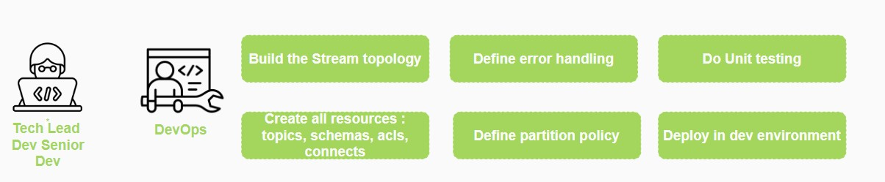
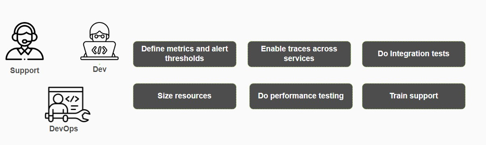

# Table of contents

- [Introduction](#introduction)
- [Concepts](#concepts)
  - [Kafka topology](#kafka-topology)
  - [_Master_ topology](#master-topology)
  - [_Micro_ topology](#micro-topology)
- [Hierarchical breakdown](#hierarchical-breakdown)
  - [Kafka Oriented "Maslow's pyramid"](#kafka-oriented-maslows-pyramid)
  - [Foundation: Business Requirements](#foundation-business-requirements)
  - [Master Topology](#master-topology-1)
  - [Micro Topology](#micro-topology-1)
  - [Pinnacle: Development](#pinnacle-development)
  - [Understanding the Pyramid](#understanding-the-pyramid)
- [What's next ?](#whats-next)
- [Master and Micro Topology visualization](#master-and-micro-topology-visualization)
  - [Master Topology](#master-topology-2)
  - [Micro Topology](#micro-topology-2)
- [Illustrated example](#illustrated-example)
- [Conclusion](#conclusion)

## Introduction

For the past 4 years, our journey into the heart of Kafka's capabilities has been shaped by two pivotal concepts: Master Topologies and Micro Topologies. These conceptual frameworks have become the backbone of our Kafka Streams application design, offering a comprehensive and granular understanding of our end-to-end communication.

>We want to personally thank [Adam Souquières](https://www.linkedin.com/in/adam-souquieres-49739080/) and [Clément Vacher](https://www.linkedin.com/in/cl%C3%A9ment-vacher-681795127/)'s contributions for bootstraping those concepts from the roots and being part of the event-driven transformation. Thank you for putting us on the right track!

## Concepts

Before delving into the heart of the article, it's required to establish a foundational understanding of some key concepts.

### Kafka topology

Topology refers to the arrangement, configuration, or structure of interconnected components. It encompasses the spatial relationships, connectivity patterns, and organization of elements within a given space or context.  
Applying this definition to the Apache Kafka ecosystem, topologies define how data flows, processes, and interacts with Kafka clusters, involving various components such as producers, consumers, streams, connectors, and topics. Kafka topologies are instrumental in shaping the overall design and functionality of a deployment

### _Master_ topology

The Master Topology is designed to provide a comprehensive visualization of the entire business process within a Kafka ecosystem. It aims to depict the sequential flow of operations involving various Kafka components and services.

### _Micro_ topology

The Micro Topology is a detailed graph visualization specifically tailored for a single Kafka Streams service. It aims to provide an in-depth understanding of the operations within the service, encompassing all DSL operations such as map, selectKey, filter, and join, while also describing the underlying logic of the Processor API. The visualization highlights interactions with input and output topics, as well as state stores.

 

## Hierarchical breakdown

### Kafka Oriented "Maslow's pyramid"

  

Drawing inspiration from Maslow's pyramid, our approach to build Kafka projects aligns with a hierarchical structure, where each level builds upon the foundation laid by the preceding one. Much like Maslow's hierarchy, the effectiveness and clarity of our Kafka develoments are contingent upon a stepwise progression, emphasizing the fundamental importance of understanding business needs.

### Foundation: Business Requirements

At the base of our Kafka hierarchy lies the bedrock – the understanding of business needs. This foundational layer, comprising 50% of our effort, parallels Maslow's physiological needs. Without a clear grasp of the business requirements, the subsequent layers risk instability. Business needs act as the sustenance for our Kafka ecosystem, steering the course and purpose of our data flows.

#### Who's needed for that step and what for ?

  

### Master Topology

Deriving from the clarity of business needs, the Master Topology serves as the safety and security tier, mirroring Maslow's safety needs. Accounting for 25% of our effort, this tier defines all functional requirements such as defining public Avro schemas and correlation keys. It also breaks down business processes into individual services, ensuring each bears a singular responsibility. Just as safety is fundamental for human well-being, a well-defined Master Topology forms the core structure that guards against complexity and confusion.

#### Who's needed for that step and what for ?

 

### Micro Topology

Moving up the pyramid, the Micro Topology equates to the social and belongingness needs in Maslow's hierarchy, occupying 15% of our effort. Here, the detailed view of services fosters a sense of community and interconnectedness. Micro Topologies delve into the specifics of each service, defining all technical requirements, establishing a shared language and understanding among developers, akin to the human need for social connections.

#### Who's needed for that step and what for ?

   

### Pinnacle: Development
At the summit of our Kafka hierarchy, the Development tier echoes Maslow's self-actualization needs. Representing the culmination of our efforts, this tier accounts for 10% of the job. Here, developers bring the Kafka ecosystem to life, translating the conceptualized topologies into functional and efficient streams applications. This tier is the realization of our architectural aspirations.

#### Who's needed for that step and what for ?

### Understanding the Pyramid
- *Synergy*: The pyramid represents a symbiotic relationship, where the foundation of business needs supports the subsequent tiers. Without a robust understanding of business requirements, the Master and Micro Topologies lack direction, and development efforts may be misaligned.
- *Iterative Nature*: Like Maslow's pyramid, our Kafka hierarchy is iterative. As business needs evolve, the pyramid adapts, ensuring the continuous alignment of our topologies with the dynamic landscape of the organization.
- *Interconnected Layers*: The layers within our pyramid are intricately linked, allowing for fluid communication and evolution across the hierarchy. For instance, designing the master topology can lead to adjustments or refinements in the expression of business requirements.

The practice of master and micro topologies for an extended four-year period has significantly contributed to our operational efficiency. Here are couple fo benefits and real-world impacts that have unfolded as a result of this sustained approach :
- **Clarity and Consistency**: By adhering to this naming convention, our Kafka topics become a language in themselves. Developers, analysts, and stakeholders can quickly decipher the purpose and nature of a topic with a mere glance, fostering a culture of clarity and consistency.
- **Efficient Development**: The convention serves as a blueprint during development, steering teams towards a standardized approach. It minimizes confusion, accelerates development cycles, and ensures a harmonious coexistence of topics within the Kafka ecosystem.
- **Enhanced Debugging and Troubleshooting**: When the unexpected occurs, the naming convention acts as a diagnostic tool. Each segment provides clues, simplifying the debugging process and facilitating swift issue resolution.

## What's next ?

Once you have reached the top of the pyramid, your services are up and running in a development environment. It is now time to consider moving to production. Before proceeding, there are still several stages to fulfill, such as conducting tests at scale, implementing monitoring and observabilitty, sizing your microservices, and so on.

#### Who's needed for that step and what for ?

## Master and Micro Topology visualization

To bring our master and micro topologies to life, we leverage the usage of Draw.io. This collaborative visualization tool proves to be exceptionally user-friendly, allowing seamless collaboration among team members (and as a side-note, it synchronizes well on OneDrive, we could even store them on Gitlab for version control as models are XML-based).

We've gone a step further to ensure a standardized and intuitive representation of components within our master and micro topologies.

### Master Topology

Master topologies represent an iterative journey in Kafka stream application design, where the use of colors plays a pivotal role in maintaining clarity and facilitating evolution. In our approach, an up-to-date topology is depicted predominantly in gray, reflecting the current state of our production environment. Introducing new elements to the topology is symbolized by the color green, while red signifies the removal of obsolete components, and orange denotes modifications to existing ones. With each significant change introduced to our production environment, dedicated master topology snapshots are created. This enables the entire team, including builders, runners, architects, and business stakeholders, to easily reference and visualize the modifications made, ensuring a streamlined and collaborative approach to managing our Kafka ecosystem's evolution.

- Example: 

- Shapes: 

  - **Diamond-Shaped** Form: Kafka Streams microservice
  - **Circular** Form : Kafka Topic
  - **Inverted House** : Kafka Connect
  - **Hexagon** Kafka Producer / Consumer microservice

 

- Regarding the colors:

  - **Grey**: Signifies that the component remains unchanged in the existing configuration.
  - **Green**: Marks the need for creating a new instance of this component.
  - **Orange**: Implies that the component needs updating.
  - **Red**: Indicates that the component, represented by this diamond shape, is slated for deletion.

### Micro Topology

- Examples: 

- Shapes:

  - **Diamond-Shaped** form: Kafka Streams operators
  - **Circular** form : Kafka Topic
  - **Cylinder** form : State store
  - **Yellow Text** Underlying logic of a specific operator

 

This standardized system of symbols and colors not only adds a visual layer to our topologies but also accelerates comprehension and decision-making during collaborative discussions on design modifications and updates. There's no global rule set for the overall company and every team can do as they prefer but having this clearly stated in your team is a pre-requesite for maintainability in the long run.

## Illustrated example

In this section, we'll explore a simplified business process centered around order management, spanning seven distinct steps. Each step within this process orchestrates specific actions with various systems within the information ecosystem.

 

Master topology is the representation of the business process on a macro level.

>_Please note that the colors utilized are for visual clarity purposes only, simplifying the representation of components, and may not directly mirror those employed in our production environments._

And when we deep dive on the “Shipping” capabilities, we can go deep into the operations done inside the Micro topology itself :

## Conclusion

In conclusion, the synergy of master and micro topologies in Kafka stream application design, accompanied by a meticulously structured naming convention, forms the backbone of a robust and maintainable ecosystem. The master topology provides a panoramic view, unraveling the complexities of business processes, while the micro topology delves into the intricacies of individual services, ensuring clarity at a granular level. The adoption of a standardized naming convention acts as a unifying language, fostering collaboration and consistency across teams. Together, these principles offer a holistic framework, guiding designers, developers, and users in crafting efficient, scalable, and comprehensible Kafka stream applications.
